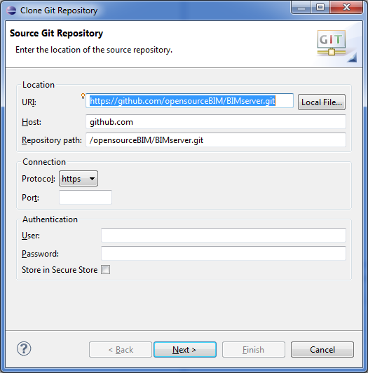
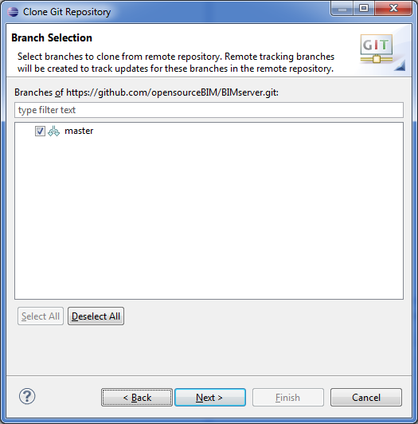
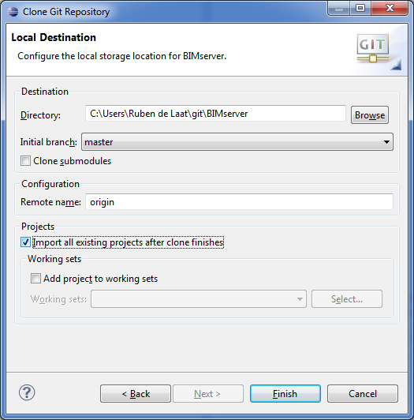
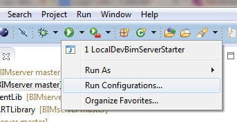
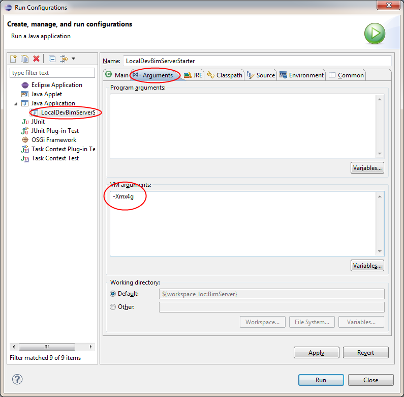
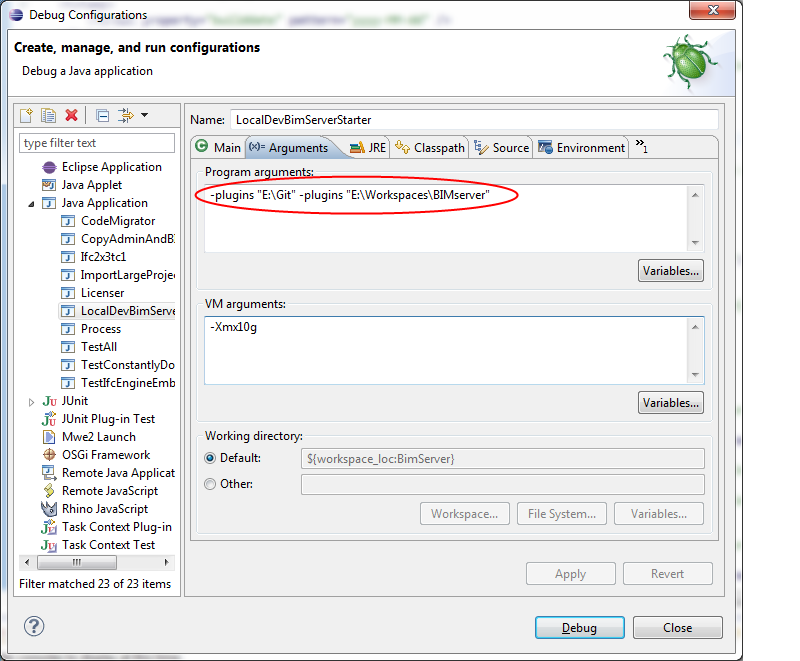

> Last updated for Eclipse Mars and BIMserver 1.5

We use Eclipse to develop BIMserver. Other IDE's should work as well, but this page describes how to get started with Eclipse.

It's best to download the "Eclipse Modeling Tools" package, but if you are not going to change the EMF model, you can also just download the "Standard" package, or use your own existing installation.

> This page describes the manual checkout of a lot of required repositories, to speed things up a bit, you can also use [Eclipse Team Project Set](https://github.com/opensourceBIM/BIMserver/wiki/Eclipse-setup-with-%22Team-project-set%22)

# GitHub

All BIMserver project are on GitHub. Eclipse should have a Git client already.

* Copy the BIMserver GitHub URL to your clipboard (https://github.com/opensourceBIM/BIMserver.git)
* Open the GIT [perspective](http://stackoverflow.com/questions/6650353/just-what-is-an-eclipse-perspective-and-how-would-i-go-about-making-one) in Eclipse
* Right click in the "Git Repositories" view and select "Paste Repository Path or URI", or just press ctrl-v


* Fill in your GitHub credentials if you have them (only required if you are planning to, and have the rights to commit).



* Next



* Finish (Select the "Import all existing projects after clone finishes" checkbox)



* Switch back to the Java perspective

# Running BIMserver from Eclipse

To run the BIMserver from eclipse, right click the BimServer**Jar** project, select "Run As" and then "Java Application", eclipse will look for classes with main methods, you have to select "LocalDevBimServerStarter", which is in the package "org.bimserver".

## Not enough memory

When Java complains there is not enough memory, you can increase the amount of heap memory the BIMserver can use in the "Run configuration". Please read these [notes](https://github.com/opensourceBIM/BIMserver/wiki/Memory-and-Java) on memory in general. Go to the tab "Arguments" and add the following to the "VM arguments": "-Xmx4g" (this is for 4GB of heap).




> Make sure you are running a 64bit JVM when assigning more than 1300MB of heap!

## Adding the plugins property

Before BIMserver 1.3 you had to manually edit some source code (LocalDevPluginLoader.java) to add the locations of your own plugins to run them. Now you can edit the Eclipse run configuration. The reason behind this is that people don't accidentally check-in the LocalDevPluginLoader file, and to make things configurable without source-code-modification.

You can add as many "plugins" parameters. So for example:
```
-plugins "C:\Users\My Name\Plugin 1" -plugins "/home/myname/plugin2"
```

Typical projects you'd want to link are:
https://github.com/opensourceBIM/bimvie.ws.git
https://github.com/opensourceBIM/BIMserver-JavaScript-API.git
https://github.com/opensourceBIM/BIMsurfer.git (Version 1 is required for BIMvie.ws to run at the moment, make sure you pick the right branch)
https://github.com/opensourceBIM/BinarySerializers.git
https://github.com/opensourceBIM/IfcOpenShell-BIMserver-plugin.git
https://github.com/opensourceBIM/IfcPlugins.git
"https://github.com/opensourceBIM/console.git

For every project, you have to clone the git repository and import the projects. Then copy the location on disk and add it as a "-plugins" argument.

If you are not planning to change any of these projects, you can of course also just install plugins the regular way.



# Setup

For local development, the BIMserver will be automatically setup. An administrator user with the username "admin@bimserver.org" will be created with the password "admin".

All of the API's are provided at http://localhost:8080, as well as a basic user interface. The admin interface is available at http://localhost:8080/apps/console.

You now have a working Eclipse environment, we look forward to your pull requests!